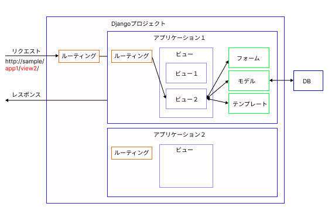

# 01_Djangoメモ
## Djangoの全体像


+ ルーティング
  + URLからどのアプリケーションのどのビューを呼び出すかを決定する。
+ ビュー
  + 司令塔の役割。モデルにデータベース操作を依頼したり、テンプレートに取得データを渡して、HTMLを生成する。
+ フォーム
  + ユーザーの入力を受け取るためのフォームを生成する。入力値のバリデーションを合わせて実施する。
+ モデル
  + データベースのテーブルを表現する。
+ テンプレート
  + ビューから渡されたデータを使ってHTMLを生成する。

## Djangoプロジェクトの構造
+ Djangoは一つのWebアプリを一つのプロジェクトとして管理する。
+ プロジェクトの中には一つ以上のアプリケーションを含めることができる。
+ アプリケーションは一つの機能を担当する。

## 雛形作成
+ Djangoプロジェクトの作成
```
# 便宜上myprojectという名前でプロジェクトを作成
django-admin startproject myproject
```

+ Djangoアプリケーションの作成
```
# 便宜上myappという名前でアプリケーションを作成
python manage.py startapp myapp
```

## ルーティング
+ URLをパターンマッチングして経路を決定する。URLディスパッチャーと呼ぶ。
+ 雛形作成時にプロジェクト内にurls.pyが自動生成される。
+ 一般的には各アプリケーションフォルダにurls.pyを作成して各アプリケーションに処理を委譲する。
+ 書き方はFBVとCBVの二つがある。

```python
# プロジェクトのurls.py
from django.contrib import admin
from django.urls import path, include

urlpatterns = [
    path('admin/', admin.site.urls),
    path('myapp/', include('myapp.urls')),
]
```

```python
# アプリケーションのurls.py
from django.urls import path
from . import views

urlpatterns = [

  # 記法には以下のように2種類ある。
  # FBV(関数ベースビュー): シンプルな関数で、状態を持たずにリクエストを処理。
  path('', views.index, name='index'),
  path('foo/', views.add, name='foo'),
  path('bar/<int:pk>/', views.bar, name='bar')

  # CBV(クラスベースビュー): クラスベースのビューロジックを使い、状態を持つことができる
  path('', views.IndexView.as_view(), name='index'),
  path('foo/', views.FooView.as_view(), name='foo'),
  path('bar/<int:pk>/', views.BarView.as_view(), name='bar')
]
```

## ビュー
+ ルーティングからリクエスト情報を受けとってレスポンスに情報を返すまでの管理塔の役割
+ 必要に応じてフォーム、モデル、テンプレートに処理を依頼する。
+ 書き方はFBVとCBVの二つがある。
+ CBVは定型的な機能を持ったクラスを継承ため記述がシンプルになる。そのため今後はCBVで記載をしていく。
+ 基底のViewクラスを継承するViewはHttpメソッドに対応するメソッドを定義する必要がある。ただし基底のViewを使うことは少ない。
+ 用意されたViewとしてCRUD操作(List、Detail、Create、Update、Delete)、Template、Form、Redirectなどがある。

```python
from django.contrib.auth.mixins import LoginRequiredMixin
from django.views.generic import ListView
from .models import Bmi

# mixinを使用することでログイン制限の実現が可能
class IndexView(LoginRequiredMixin, ListView):
    model = Bmi
    template_name = 'example.html'
    
    # オーバーライド。記述がない場合は全データがテンプレートに渡される。
    def get_queryset(self):
        return Bmi.objects.filter(user=self.request.user)
```
## フォーム
+ 画面に入力された値をフォームオブジェクトに変換するコンポーネント。
+ 入力値のバリデーションを実施する。
+ forms.pyに定義する。このファイルは自動生成されないため作成する必要がある。
+ フォームはFormクラスまたはModelFormクラスを継承して定義する。
+ モデルのフィールドとフォーム画面のフィールドが同じ場合はModelFormを使用したほうが簡潔に記載できる。

```python
# Formクラス継承例
from django import forms

class InputForm(forms.Form):
  name = forms.CharField(label='お名前', max_length=30)
  email = forms.EmailField(label='メールアドレス')
  message = forms.CharField(label='メッセージ', widget=forms.Textarea)
```

```python
# ModelFormクラスを継承
from django import forms
from .models import Inquiry

class InquiryForm(forms.ModelForm):
  class Meta:
    model = Inquiry
    field = ('name', 'email', 'message',)
```

+ 独自バリデーションを定義することができる。
+ 独自バリデーションは`validators`、`clean_<フィールド名>`、`clean`を使用する。
  
```python
# validators使用例
# validators：異なるフォーム、モデル間で同じバリデーションを共有する

# validate.py
from django.core.exception import ValidationError
def validate_admin(value):
  if 'admin' in value:
    raise ValidatinError('adminを含んだメールアドレスは利用できません')

# forms.py
from django import forms
from .validate import validate_admin
class EmailForm(forms.Form):
  email = forms.EmailField(label='メールアドレス', validators=[validate_admin])

# models.py
from django.db import models
from .validate import validate_admin
class Email(models.Model):
  email = models.EmailField(varbose_name='メールアドレス', validators=[validate_admin])
```

```python
# clean_<フィールド名>使用例
# 単一フォーム内で単体フィールドバリデーションを行う
from django import form
class EmailForm(forms.Form):
  email = forms.EmailField(label='メールアドレス')
  def clean_email(self):
    # バリデーションを通過してきた値が格納される
    email = self.cleaned_data['email']
    if 'admin' in email:
      raise forms.ValidationError('adminを含んだメールアドレスはご利用頂けません')
```

```python
# clean使用例
# 単一フォーム内でフィールドをまたがるバリデーションを行う。相関チェックに有効
from django import forms
class EmailForm(forms.Form):
  email_1 = forms.EmailField(label='メールアドレス1')
  email_2 = forms.EmailField(label='メールアドレス2')

  def clean(self):
    cleaned_data = super().clean()
    email_1 = cleaned_data.get('email_1')
    email_2 = cleaned_data.get('email_2')

    if 'admin' in email_1 and 'admmin' in email_2:
      raise forms.ValidationError('adminを含んだメールアドレスはご利用頂けません')
```

